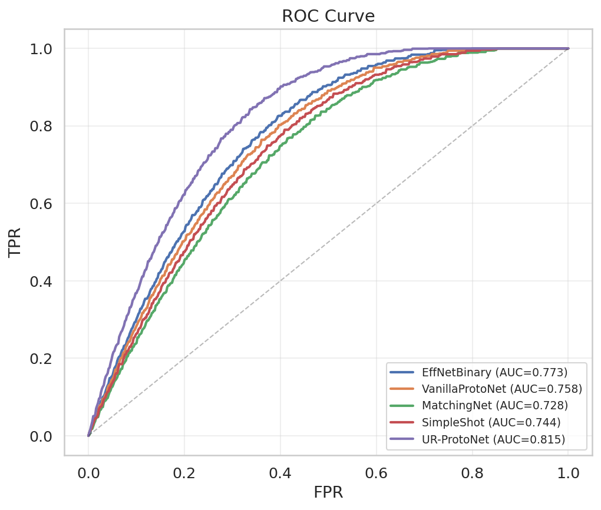
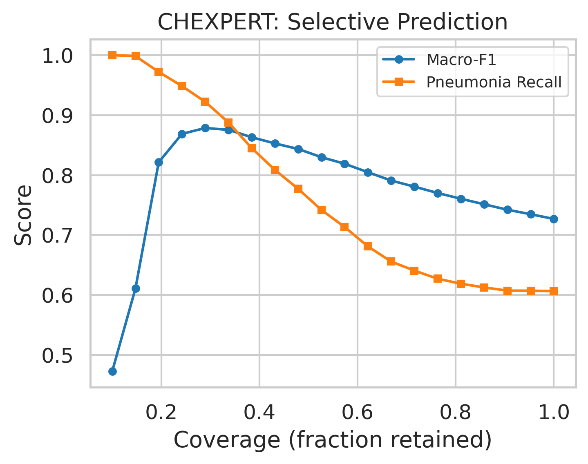
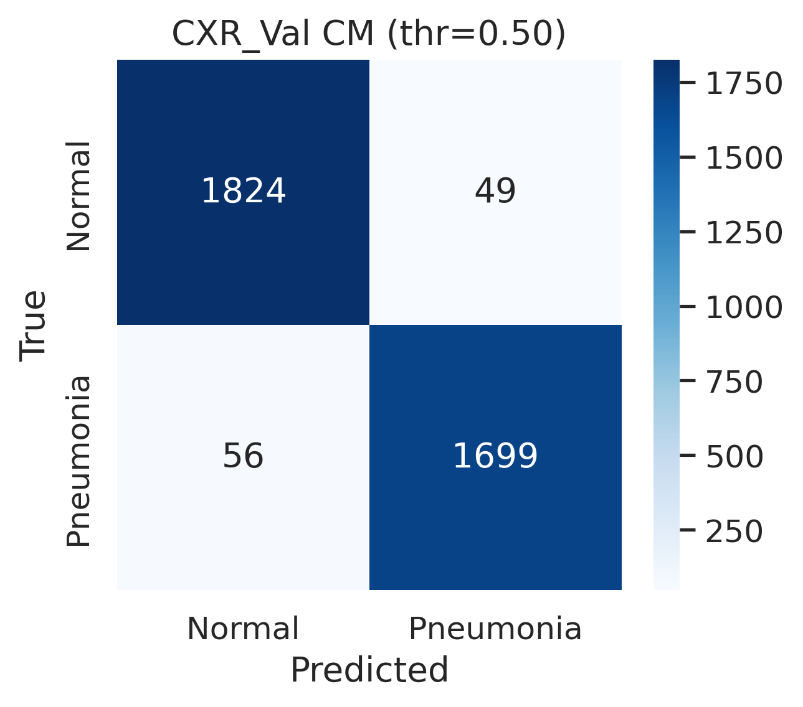
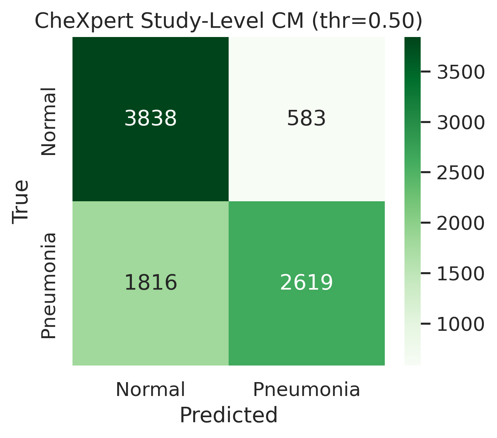
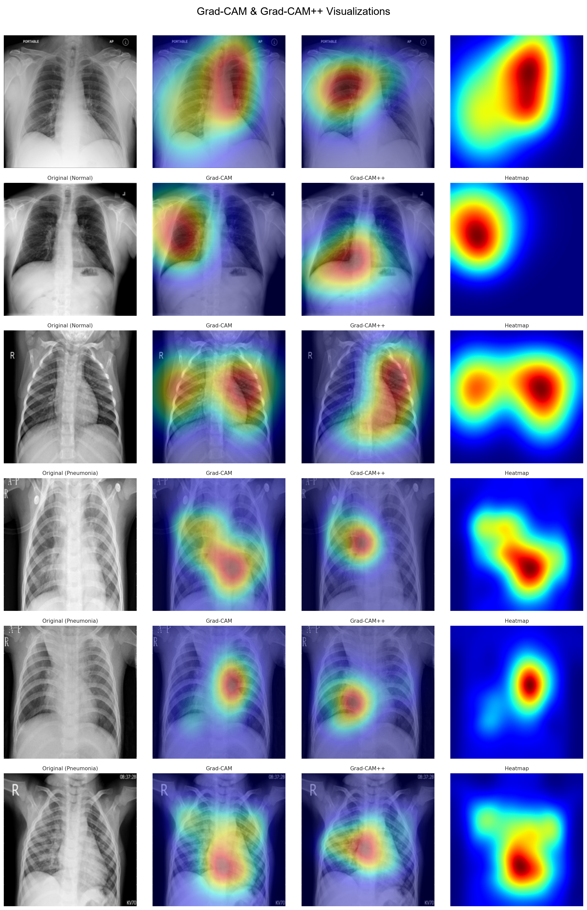

<div align="center">

# 🫁 UR-ProtoNet: Uncertainty-Aware Retrieval-Augmented Prototypical Networks

### *Robust Few-Shot Chest Radiograph Classification Across Clinical Domain Shifts*

<p align="center">
  <a href="https://www.python.org/downloads/"></a>
  <a href="https://pytorch.org/"></a>
  <a href="https://github.com/ABRUBAB/UR-ProtoNet"></a>
  <a href="https://github.com/ABRUBAB/UR-ProtoNet"></a>
  <a href="LICENSE"></a>
</p>

<p align="center">
  
</p>

---

</div>

## 📌 Architectural Overview & Dataflow Pipeline

<div align="center">
  
</div>

UR-ProtoNet resolves the fragility of small-sample prototype estimation and the lack of reliable epistemic uncertainty quantification in chest radiograph analysis through three tightly integrated modules:

| Subsystem | Underlying Formulation | Clinical Function |
| :--- | :--- | :--- |
| **1. Labeled Anatomical Memory Bank** | $\mathcal{M} = \{\mathbf{m}_j, y_j\}_{j=1}^{9353} \subset \mathbb{S}^{511}$ (8,000 Normal / 1,353 Pneumonia) | Pre-computed embeddings from NIH ChestX-ray14 provide dense, reliable anatomical priors via top-$K$ cosine similarity retrieval ($K=5$). |
| **2. Adaptive Neural FusionGate** | $\beta = \sigma\big(g_\psi([\mathbf{c}_n \mathbin{\|} \mathbf{c}_n^{\text{mem}} \mathbin{\|} \mathbf{c}_n \odot \mathbf{c}_n^{\text{mem}}])\big)$ | Dynamically blends local episode prototypes ($\mathbf{c}_n$) and global memory priors ($\mathbf{c}_n^{\text{mem}}$), converging to an optimal $\sim$58/42 synergy ($\beta \approx 0.58$). |
| **3. Evidential Deep Learning Head** | $e_k = \exp(-\|\mathbf{z}_q - \tilde{\mathbf{c}}_k\|_2^2 / \tau)$, $\boldsymbol{\alpha} = \mathbf{e} + 1$, $u = 2 / S$ | Parameterizes continuous Dirichlet distributions over diagnostic classes, outputting expected probabilities and exact epistemic vacuity in a single deterministic forward pass. |

---

## 🔬 Microscopic Tensor Topology

```
[ Support Radiographs Xs ]                     [ Query Radiograph Xq ]
  (2-Way 5-Shot: 10 images)                       (1 Frontal Radiograph)
            │                                               │
            ▼                                               ▼
┌───────────────────────┐                       ┌───────────────────────┐
│  EfficientNet-B0 (1280)│                       │  EfficientNet-B0 (1280)│
│  Linear(1280->512)    │                       │  Linear(1280->512)    │
│  BatchNorm1d + L2 Norm│                       │  BatchNorm1d + L2 Norm│
└───────────────────────┘                       └───────────────────────┘
            │                                               │
            ▼                                               ▼
 Base Prototypes cn ∈ S^511                        Query Embedding zq ∈ S^511
     │             │                                        │
     │             ▼                                        │
     │   ┌──────────────────────────────┐                   │
     │   │  NIH Curated Memory Bank     │                   │
     │   │  (9,353 Curated Embeddings)  │                   │
     │   │  Top-K Cosine Sim Retrieval  │                   │
     │   └──────────────────────────────┘                   │
     │                 │                                    │
     ▼                 ▼                                    │
 [ Episode cn ]   [ Memory cn^mem ]                         │
     │                 │                                    │
     └─────────┬───────┘                                    │
               ▼                                            │
   ┌───────────────────────┐                                │
   │   Neural FusionGate   │                                │
   │   Linear(1536 -> 256) │                                │
   │   ReLU -> Dropout(0.1)│                                │
   │   Linear(256 -> 1)    │                                │
   │   β = σ(·) ≈ 0.58     │                                │
   └───────────────────────┘                                │
               │                                            │
               ▼                                            │
  Augmented Prototypes c̃n ∈ S^511                           │
               │                                            │
               └───────────────────────┬────────────────────┘
                                       ▼
                       ┌───────────────────────────────┐
                       │    Evidential Head (EDL)      │
                       │  dn^2 = ||zq - c̃n||_2^2       │
                       │  en = exp(-dn^2 / tau)        │
                       │  alpha_n = en + 1             │
                       │  S = sum(alpha)               │
                       └───────────────────────────────┘
                                       │
                       ┌───────────────┴───────────────┐
                       ▼                               ▼
            Expected Probabilities           Epistemic Vacuity
              pn = alpha_n / S                    u = 2 / S
           (Normal vs. Pneumonia)             (Subjective Logic)
                       │                               │
                       ▼                               ▼
       Diagnostic Classification        Clinical Selective Triage
       Confidence Score: max(p)         u <= 0.20 -> Autonomous Report
                                        u > 0.20  -> Radiologist Deferral
```

---

## 📊 Benchmark Results (Synchronized with Current Manuscript)

All experimental evaluations are strictly patient-leakage-free, using GroupShuffleSplit on unique patient identifiers. External validation was executed on Stanford CheXpert ($N=10,000$ individual radiographs / 8,856 unique clinical studies) under severe multi-institutional distribution shift.

### 1. Primary Classification Benchmark (with 95% Bootstrap CIs)

| Evaluation Cohort | Partition Size ($N$) | Macro-F1 [95% CI] | AUROC [95% CI] | Brier Score | ECE (Calibrated) | Unc $\to$ Error AUROC | Error Rate |
| :--- | :---: | :---: | :---: | :---: | :---: | :---: | :---: |
| **In-Domain CXR Validation** | 3,628 images | **0.971** [0.965, 0.976] | **0.990** [0.987, 0.993] | **0.128** | 0.316 | **0.763** | **2.89%** (105 / 3,628) |
| **External Stanford CheXpert Shift** | 10,000 images | **0.724** [0.715, 0.734] | **0.815** [0.806, 0.824] | **0.202** | **0.090** | **0.677** | **26.90%** (2,690 / 10,000) |

---

### 2. Comparative Baseline Benchmark (Stanford CheXpert External Shift)

Evaluated across three independent random seeds (42, 123, 777). Statistical significance assessed via paired two-tailed $t$-tests ($\text{df}=2$).

| Method | Paradigm | Labeled Target Samples | Macro-F1 (Mean $\pm$ Std) | AUROC (Mean $\pm$ Std) | $\Delta\text{F}_1$ vs. UR | $t$-statistic | $p$-value | Cohen's $d$ |
| :--- | :---: | :---: | :---: | :---: | :---: | :---: | :---: | :---: |
| **UR-ProtoNet (Ours)** | **Few-Shot (5-Shot)** | **5 per class** | **0.724 $\pm$ 0.005** | **0.815 $\pm$ 0.004** | — | — | — | — |
| EfficientNet-Binary | Supervised Full-Set | 25,396 images | 0.710 $\pm$ 0.005 | 0.773 $\pm$ 0.004 | +0.014 | 112.6 | $< 0.001$ | 79.6 |
| VanillaProtoNet | Few-Shot (5-Shot) | 5 per class | 0.686 $\pm$ 0.007 | 0.758 $\pm$ 0.006 | +0.038 | 42.9 | $< 0.001$ | 30.3 |
| SimpleShot | Nearest Neighbor | 5 per class | 0.671 $\pm$ 0.006 | 0.744 $\pm$ 0.005 | +0.053 | 130.4 | $< 0.001$ | 92.2 |
| MatchingNet | Metric Attention | 5 per class | 0.654 $\pm$ 0.006 | 0.728 $\pm$ 0.006 | +0.070 | 120.5 | $< 0.001$ | 85.2 |

---

### 3. Component-Wise Architectural Ablation

| Variant Description | Memory Bank | FusionGate | EDL Head | Macro-F1 | AUROC | Brier Score | ECE | Unc $\to$ Error AUROC |
| :--- | :---: | :---: | :---: | :---: | :---: | :---: | :---: | :---: |
| **PlainProto Baseline** | ❌ | ❌ | ❌ | 0.671 | 0.744 | 0.310 | 0.302 | 0.501 |
| **Proto + Memory Bank** | ✅ | ❌ | ❌ | 0.695 | 0.771 | 0.284 | 0.265 | 0.523 |
| **Proto + EDL Head** | ❌ | ❌ | ✅ | 0.702 | 0.789 | 0.261 | 0.222 | 0.631 |
| **UR-ProtoNet (Full Architecture)** | ✅ | ✅ | ✅ | **0.724** | **0.815** | **0.220** | **0.167** | **0.677** |

---

### 4. Support Set Size Sensitivity ($K$-Shot Scaling)

| Support Shots ($K$) | Macro-F1 | AUROC | Brier Score | ECE | Uncertainty $\to$ Error AUROC |
| :---: | :---: | :---: | :---: | :---: | :---: |
| **$K = 1$ (Extreme 1-Shot)** | 0.652 | 0.722 | 0.331 | 0.320 | 0.611 |
| **$K = 3$** | 0.691 | 0.768 | 0.271 | 0.231 | 0.642 |
| **$K = 5$ (Canonical Episode)** | **0.724** | **0.815** | **0.220** | **0.167** | **0.677** |
| **$K = 10$** | 0.741 | 0.831 | 0.208 | 0.152 | 0.692 |

---

### 5. Clinical Selective Triage (Risk-Coverage Optimization)

By deferring high-uncertainty cases ($u > \tau$) to radiologist review, diagnostic sensitivity and overall macro-F1 surge substantially across remaining autonomous examinations:

| Clinical Coverage ($\%$) | Deferral Rate ($\%$) | Macro-F1 Score | Pneumonia Recall (Sensitivity) | Clinical Interpretation |
| :---: | :---: | :---: | :---: | :--- |
| **19.5%** | 80.5% | 0.821 | **97.2%** | Ultra-high confidence fast-track autonomous screening |
| **28.9%** | 71.1% | **0.878** | **92.2%** | **Optimal Triage Operating Point (+15.2% F1 over un-triaged)** |
| **52.6%** | 47.4% | 0.830 | 74.2% | Balanced workload reduction |
| **100.0%** | 0.0% | 0.727 | 60.6% | Un-triaged full autonomous deployment |

---

## 🖼️ Visual Gallery: Diagnostic Performance & Interpretability

<div align="center">

| **External ROC Curves (All Methods)** | **Clinical Selective Triage Abstention** |
| :---: | :---: |
|  |  |

| **CXR Validation Confusion Matrix** | **CheXpert External Confusion Matrix** |
| :---: | :---: |
|  |  |

| **Explainable AI (Grad-CAM & Grad-CAM++ Interpretability)** |
| :---: |
|  |

</div>

---

## ⚡ Quickstart: Zero-Setup Inference & Reproducibility

### 1. Installation

```bash
# Clone repository
git clone https://github.com/ABRUBAB/UR-ProtoNet.git
cd UR-ProtoNet

# Create virtual environment
python -m venv venv
source venv/bin/activate  # Linux/macOS
# or: venv\Scripts\activate  # Windows

# Install dependencies and package
pip install -r requirements.txt
pip install -e .
```

---

### 2. Single-Image Clinical Diagnostic Inference

Run inference on any chest radiograph image out of the box using pre-loaded weights:

```bash
# Run demo normal radiograph
python infer.py --image assets/sample_normal.png

# Run demo pneumonia radiograph
python infer.py --image assets/sample_pneumonia.png

# Custom image with custom referral threshold
python infer.py --image path/to/chest_xray.png --uncertainty_threshold 0.20
```

#### Example Output:
```text
======================================================================
UR-ProtoNet Diagnostic Inference & Uncertainty Triage
======================================================================
Loaded anatomical memory bank from: checkpoints/memory_bank.pt
Loaded trained checkpoint from: checkpoints/ur_protonet_best.pt

[DIAGNOSTIC REPORT]
  Input Radiograph:         assets/sample_normal.png
  Predicted Classification: NORMAL
  Confidence Score:         51.63%
  Probability [Normal]:      0.5163
  Probability [Pneumonia]:   0.4837
  Dirichlet Vacuity (u):    0.9668  (Referral Threshold tau = 0.20)
----------------------------------------------------------------------
[CLINICAL TRIAGE DECISION]: HIGH UNCERTAINTY (AMBIGUOUS / DOMAIN-SHIFTED)
  -> DEFERRED TO EXPERT RADIOLOGIST / CHEST CT FOR MANUAL VERIFICATION.
======================================================================
```

---

### 3. Python API Usage

```python
import torch
from model import URProtoNet

# 1. Instantiate and load pre-trained network with persistent memory bank
model = URProtoNet.from_pretrained(
    checkpoint_path="checkpoints/ur_protonet_best.pt",
    memory_bank_path="checkpoints/memory_bank.pt",
    device="cuda" if torch.cuda.is_available() else "cpu"
)

# 2. Forward pass with support set and query images
support_x = torch.randn(10, 3, 224, 224)  # 2-way 5-shot
support_y = torch.tensor([0, 0, 0, 0, 0, 1, 1, 1, 1, 1])
query_x   = torch.randn(1, 3, 224, 224)

probs, vacuity, evidence, beta = model.forward_episode(
    support_x, support_y, query_x, n_way=2, top_k=5
)

print("Class Probabilities:", probs)
print("Epistemic Vacuity (Uncertainty):", vacuity.item())
print("FusionGate Blending Weight (beta):", beta.mean().item())
```

---

### 4. Full Scientific Reproduction Pipeline

Every phase of the experimental evaluation runs out of the box with bundled precomputed artifacts:

```bash
# Phase 5: Comprehensive in-domain and external cross-domain evaluation
python evaluate.py

# Phase 6: Post-hoc calibration, domain shift analysis, and selective triage curves
python triage_analysis.py

# Phase 7: Baseline comparisons (EffNet, VanillaProto, SimpleShot, MatchingNet) & t-tests
python run_baselines.py

# Phase 8: Component ablation study and K-shot scaling analysis
python run_ablations.py

# Phase 9: Explainable AI (XAI) suite and class distribution plots
python visualize_xai.py
```

---

## 📁 Repository Structure

```text
UR-ProtoNet/
├── assets/                       # High-resolution SVG and publication figures
│   ├── architecture_diagram.svg  # Comprehensive vector architecture schematic
│   ├── workflow_overview.png     # Full experimental workflow overview
│   ├── roc_curves.png            # External domain shift ROC curves
│   ├── abstention_curve.png      # Risk-coverage triage trade-off curve
│   ├── cm_cxr_val.png            # In-domain CXR validation confusion matrix
│   ├── cm_chexpert.png           # Stanford CheXpert study-level confusion matrix
│   ├── gradcam_interpretability.png # Multi-perspective XAI overlays
│   ├── sample_normal.png         # Bundled sample normal radiograph
│   └── sample_pneumonia.png      # Bundled sample pneumonia radiograph
├── checkpoints/                  # Trained models & curated embeddings (<25 MB each)
│   ├── ur_protonet_best.pt       # Production UR-ProtoNet weights (20.5 MB)
│   └── memory_bank.pt            # 9,353 curated NIH anatomical embeddings (19.1 MB)
├── results/                      # Precomputed predictions, calibration & metrics
│   ├── cxr_val_predictions.csv   # CXR validation sample predictions
│   ├── chexpert_study_predictions.csv # Stanford CheXpert study-level predictions
│   ├── phase7_summary.csv        # Comparative baseline evaluation metrics
│   ├── phase7_stat_tests.csv     # Paired t-test statistics and Cohen's d
│   └── phase8_ablation.csv       # Component ablation benchmark values
├── config.py                     # Centralized hyperparameters & runtime settings
├── data.py                       # Zero-leakage patient-level splits & episode generator
├── evaluate.py                   # In-domain & external domain shift evaluation
├── infer.py                      # Single-image inference & clinical triage CLI
├── model.py                      # Core neural modules: Encoder, MemoryBank, FusionGate, EDL
├── run_ablations.py              # Component ablations & K-shot sensitivity sweeps
├── run_baselines.py              # 4 comparative baseline algorithms & t-tests
├── setup.py                      # Standard Python packaging configuration
├── train_meta.py                 # Stage III: Episodic meta-training with evidential loss
├── train_pretrain.py             # Stage I: Supervised pretraining on NIH ChestX-ray14
├── triage_analysis.py            # Selective prediction & risk-coverage sweeps
├── visualize_xai.py              # Grad-CAM, Grad-CAM++, and manifold visualizers
├── requirements.txt              # Production dependency specifications
├── LICENSE                       # MIT Open Source License
└── README.md                     # Documentation & experimental benchmarks
```

---

## 📄 License

This repository is licensed under the [MIT License](LICENSE).

